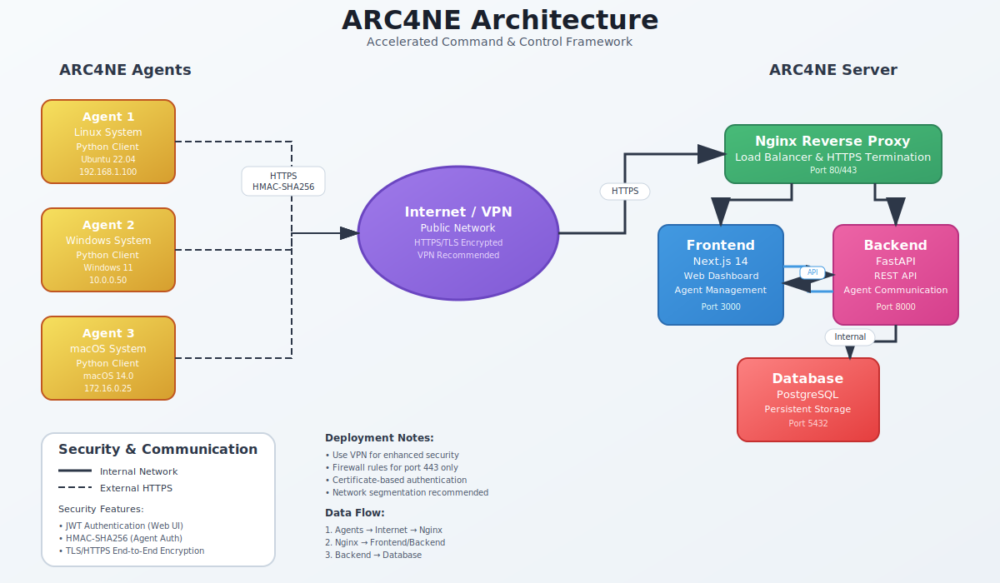

# ARC4NE - Accelerated Remote Configuration, Collection, Command, and Control for Node-based Environments

[](https://github.com/your-org/arc4ne)
[](LICENSE)
[](docker-compose.yml)

ARC4NE is a modern, secure command and control (C2) framework designed for legitimate system administration, security testing, and network management purposes. Built with a containerized microservices architecture, it provides centralized management of distributed agents with real-time telemetry and task execution capabilities.

## 🏗️ Architecture



### System Components

| Component | Technology | Port | Purpose |
|-----------|------------|------|---------|
| **Frontend** | Next.js 14 | 3000 | Web UI for agent management and telemetry |
| **Backend** | FastAPI | 8000 | REST API and agent communication |
| **Database** | PostgreSQL | 5432 | Persistent storage for agents, tasks, telemetry |
| **Reverse Proxy** | Nginx | 80/443 | HTTPS termination and load balancing |
| **Agents** | Python | - | Lightweight beaconing clients |

### Communication Flow

1. **Web UI** ↔ **Nginx** ↔ **FastAPI Backend** (HTTPS/JWT)
2. **Agents** ↔ **Nginx** ↔ **FastAPI Backend** (HTTPS/HMAC-SHA256)
3. **Backend** ↔ **PostgreSQL** (Internal network)

## ✨ Features

### Core Functionality
- **Secure Agent Communication**: HMAC-SHA256 authenticated agent beacons with pre-shared keys
- **Task Management**: Queue and execute commands on remote agents with real-time status tracking
- **Real-time Telemetry**: Comprehensive system metrics and performance monitoring
- **Web Interface**: Modern React-based dashboard for centralized management
- **HTTPS/TLS**: Full encryption for all communications with self-signed certificate support

### Security Features
- JWT-based authentication for web users
- HMAC-SHA256 message authentication for agents
- Pre-shared key agent registration
- HTTPS/TLS encryption for all communications
- Role-based access control (RBAC)

### Operational Features
- Containerized deployment with Docker Compose
- Cross-platform agent support (Linux, Windows, macOS)
- Real-time agent status monitoring
- Task queue management with execution history
- Telemetry data visualization
- Agent configuration management

## 🚀 Quick Start

### Prerequisites

- Docker and Docker Compose
- Git
- OpenSSL (for HTTPS certificates)

### Installation

1. **Clone the repository**:
```bash
git clone https://github.com/your-org/arc4ne.git
cd arc4ne
```

2. **Set up environment variables**:
```bash
cp .env.example .env
# Edit .env with your configuration
```

3. **Start the services**:
```bash
docker-compose up -d
```

4. **Verify deployment**:
```bash
# Check service status
docker-compose ps

# View certificate information
./scripts/cert-info.sh
```

5. **Access the web interface**:
   - Open https://localhost (accept self-signed certificate warning)
   - Default credentials: `admin` / `admin123`

## 🤖 Agent Deployment

### Quick Agent Setup

1. **Generate agent configuration**:
   - Navigate to the Agents page in the web UI
   - Click "Register New Agent"
   - Copy the generated configuration

2. **Deploy agent**:
```bash
# On target system
cd agent/
python3 arc4ne_agent.py --config-file agent_config.json
```

### Agent Configuration

Example agent configuration:
```json
{
  "server_url": "https://your-arc4ne-server.com",
  "agent_id": "agent-001",
  "shared_key": "your-generated-key",
  "beacon_interval": 30,
  "max_jitter": 10,
  "verify_ssl": false
}
```

### Agent Installation Options

**Enhanced installation (recommended)**:
```bash
pip3 install requests psutil
python3 arc4ne_agent.py
```

**Basic installation (limited telemetry)**:
```bash
pip3 install requests
python3 arc4ne_agent.py
```

## 📊 Usage

### Web Interface

1. **Dashboard**: Overview of agent status and system health
2. **Agents**: Manage registered agents and view telemetry
3. **Tasks**: Create, queue, and monitor task execution
4. **Telemetry**: Real-time system metrics and performance data

### API Usage

**Agent Registration**:
```bash
curl -X POST https://localhost/api/agents/register \
  -H "Content-Type: application/json" \
  -d '{
    "agent_id": "test-agent",
    "hostname": "test-host",
    "platform": "linux",
    "shared_key": "your-key"
  }'
```

**Task Creation**:
```bash
curl -X POST https://localhost/api/tasks \
  -H "Authorization: Bearer YOUR_JWT_TOKEN" \
  -H "Content-Type: application/json" \
  -d '{
    "agent_id": "test-agent",
    "command": "whoami",
    "task_type": "shell"
  }'
```

**Telemetry Query**:
```bash
curl -X GET "https://localhost/api/telemetry?agent_id=test-agent&hours=24" \
  -H "Authorization: Bearer YOUR_JWT_TOKEN"
```

## 🔧 Configuration

### Environment Variables

| Variable | Description | Default |
|----------|-------------|---------|
| `POSTGRES_DB` | Database name | `arc4ne` |
| `POSTGRES_USER` | Database user | `arc4ne_user` |
| `POSTGRES_PASSWORD` | Database password | `secure_password` |
| `JWT_SECRET_KEY` | JWT signing key | `your-secret-key` |
| `ADMIN_USERNAME` | Default admin user | `admin` |
| `ADMIN_PASSWORD` | Default admin password | `admin123` |

### Service Configuration

**Backend (FastAPI)**:
- Configuration: `backend/app/main.py`
- Database models: `backend/app/models.py`
- API routes: `backend/app/routers/`

**Frontend (Next.js)**:
- Configuration: `frontend/next.config.mjs`
- API client: `frontend/lib/api.ts`
- Components: `frontend/components/`

**Nginx**:
- Configuration: `nginx/nginx.conf`
- SSL certificates: `nginx/certs/`

## 🛠️ Development

### Local Development Setup

1. **Backend development**:
```bash
cd backend
pip install -r requirements.txt
uvicorn app.main:app --reload --host 0.0.0.0 --port 8000
```

2. **Frontend development**:
```bash
cd frontend
npm install
npm run dev
```

3. **Database setup**:
```bash
docker-compose up -d postgres
```

### Testing

Run the test suite:
```bash
# Backend tests
cd backend
python -m pytest

# Frontend tests
cd frontend
npm test

# Integration tests
./scripts/run-tests.sh
```

## 🔍 Troubleshooting

| Issue | Solution |
|-------|----------|
| **Certificate warnings** | Accept self-signed cert or install CA certificate |
| **Agent connection failed** | Check firewall rules and certificate configuration |
| **Database connection error** | Verify PostgreSQL container is running and credentials |
| **Port conflicts** | Modify ports in `docker-compose.yml` |
| **Permission denied** | Ensure scripts are executable: `chmod +x scripts/*.sh` |

### Common Commands

**View logs**:
```bash
# All services
docker-compose logs -f

# Specific service
docker-compose logs -f backend
```

**Reset database**:
```bash
docker-compose down -v
docker-compose up -d
```

**Update certificates**:
```bash
./scripts/setup-https.sh --force
docker-compose restart nginx
```

## 📚 Documentation

- [Product Roadmap](docs/01-product-roadmap.md)
- [Service Architecture](docs/02-service-architecture.md)
- [Security Model](docs/03-security-model.md)
- [Agent Design](docs/04-agent-design.md)
- [API Documentation](docs/05-api-design.md)
- [Database Schema](docs/06-database-schema.md)
- [UI Design](docs/07-ui-design.md)
- [Development Strategy](docs/08-dev-strategy.md)
- [HTTPS Setup Guide](docs/HTTPS_SETUP.md)

## 🤝 Contributing

1. Fork the repository
2. Create a feature branch: `git checkout -b feature/amazing-feature`
3. Commit changes: `git commit -m 'Add amazing feature'`
4. Push to branch: `git push origin feature/amazing-feature`
5. Open a Pull Request

## ⚖️ Legal Notice

ARC4NE is designed for legitimate system administration, security testing, and network management purposes. Users are responsible for ensuring compliance with all applicable laws and regulations. Unauthorized access to computer systems is illegal.

## 📄 License

This project is licensed under the MIT License - see the [LICENSE](LICENSE) file for details.

## 🔗 Links

- [Documentation](docs/)
- [Issue Tracker](https://github.com/your-org/arc4ne/issues)
- [Releases](https://github.com/your-org/arc4ne/releases)
- [Docker Hub](https://hub.docker.com/r/your-org/arc4ne)

---

**Version**: 0.3.1 | **Build**: Stable (MVP) | **Last Updated**: June 2025
